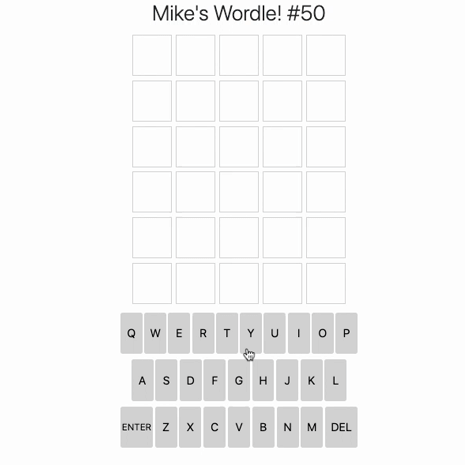

# Mike's Wordle

Welcome to my recreation of the Wordle game!  I made this as a fun challenge and because I wanted to be in charge of a Wordle game intended for people I know.  It was a great exercise in JavaScript and general programming logic.  I've learned a lot since making this game, perhaps learning better ways I could have coded this game, but this speaks to my fondness for logic and problem-solving. Enjoy!

[Click here to try it out!!](https://mseaman26.github.io/Mike-s-Wordle/)

  ## Overview of the application


​


​
  ## Technologies Used

  - JavaScript
  - JQuery
  - CSS
  - Bootstrap Framework
  - HTML

​
  ## Code Snippets
```javascript
</img>
```
Here is the code for making and formatting the tile emoji message that is used by the share button. This lets the user share their results without giving away the word.  My friends and family love to send me their results!
```javascript
const greenTile = "🟩"
const orangeTile = "🟨"
const whiteTile = "⬜"
    
function makeTilesForSharing(){
    let tilesString = "Mike's Wordle #"+currentWordleNumber+"\n"
    let count =0
    for(let i = 0; i < 30; i++){
        count += 1
        if(document.getElementById("letter-box"+i).classList.contains("custom-green")){
            tilesString += greenTile
        }else if(document.getElementById("letter-box"+i).classList.contains("custom-orange")){
            tilesString += orangeTile
        }else if(document.getElementById("letter-box"+i).classList.contains("custom-gray")){
            tilesString += whiteTile
        }else {
            return tilesString
        }
        if(count % 5 == 0){
            tilesString = tilesString+"\n"
        }
    }
    return tilesString
}

$('#share-button').on('click', () => {
        let tileText  = makeTilesForSharing()
        if (navigator.share) {
          navigator.share({
              title: "Results From Mike's Wordle:",
              text: tileText,
            })
            .then(() => console.log('Successful share'))
            .catch((error) => console.log('Error sharing', error));
        } else {
          console.log('Share not supported on this browser, do it the old way.');
        }
      });
```
Here is the code that renders the page.  As mentioned above, I've learned a lot since writing this program, but it shows me using the knowledge I had at the time to get the result I wanted.  Since it works just fine, I haven't been compelled to refactor it as of yet
```javascript
const querty = ["Q", "W", "E", "R", "T","Y", "U","I","O", "P", "A", "S", "D", "F", "G", "H", "J", "K", "L", "ENTER", "Z", "X", "C", "V", "B", "N", "M", "DEL"]

function drawLetterBoxes(){
    for(let i = 0; i<30;i++){
        let letterBox = $("<div>")
        letterBox.attr("class", "letter-box")
        letterBox.attr("id", "letter-box"+i)
        $(".letter-container").append(letterBox)
    }
}
function makeTopRowOFKeyboard (){
    for(let i = 0; i < 10;i++){
        keyboardButton = document.createElement("button")
        keyboardButton.setAttribute("class", "keyboard-button container")
        keyboardButton.setAttribute("id", "key-"+querty[i])
        keyboardButton.innerHTML = querty[i]
        document.getElementById("keyboard-row1").appendChild(keyboardButton)
    }
}
function makeMiddleRowOfKeyboard(){
    for(let i = 10; i < 19; i++){
        keyboardButton = document.createElement("button")
        keyboardButton.setAttribute("class", "keyboard-button container")
        keyboardButton.setAttribute("id", "key-"+querty[i])
        keyboardButton.innerHTML = querty[i]
        document.getElementById("keyboard-row2").appendChild(keyboardButton)
    }
}
function MakeBottomRowOfKeyboard(){
    let enterButton = document.createElement("button")
    enterButton.setAttribute("class", "keyboard-button container big-keyboard-button")
    enterButton.setAttribute("id", "enter-button")
    enterButton.innerHTML = "ENTER"
    document.getElementById("keyboard-row3").appendChild(enterButton)

    for(let i = 20; i <27; i++){
        let keyboardButton = document.createElement("button")
        keyboardButton.setAttribute("class", "keyboard-button container")
        keyboardButton.setAttribute("id", "key-"+querty[i])
        keyboardButton.innerHTML = querty[i]
        document.getElementById("keyboard-row3").appendChild(keyboardButton)
    }

    let deleteButton = document.createElement("button")
    deleteButton.setAttribute("class", "keyboard-button container big-keyboard-button")
    deleteButton.setAttribute("id", "key-DEL")
    deleteButton.innerHTML = "DEL"
    document.getElementById("keyboard-row3").appendChild(deleteButton)
}
```
    
    
  ## Contact

* [Email](mailto:mseaman26@gmail.com)
* [Github](https://github.com/mseaman26)
* [LinkedIn](https://www.linkedin.com/in/michael-seaman-120a59250/)
* [Portfolio](https://mseaman26.github.io/React-Portfolio-site/)
